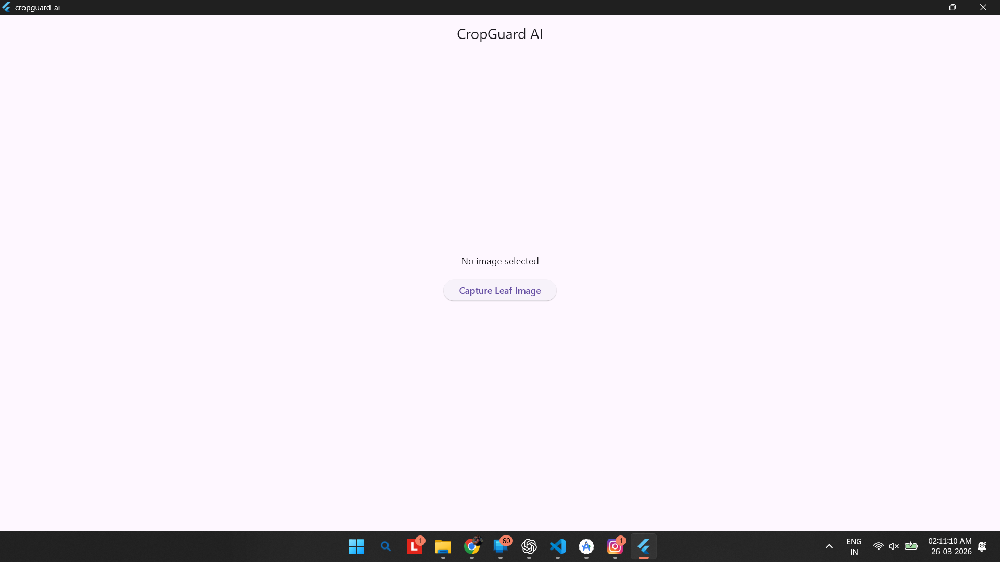

# 🌱 CropGuard AI

CropGuard AI is a smart mobile application that helps farmers detect crop diseases using AI.

---

## 🚀 Features
- 📷 Capture crop images
- 🤖 AI-based disease detection
- 🌿 Suggest solutions for crops
- 📊 Easy-to-use interface

---

## 🛠️ Tech Stack
- Flutter
- Dart
- AI / ML (Future Integration)

---

## 📸 App Screenshot

---

## 👨‍💻 Team
- **Team Name:** Late Night Coder  
- **Leader:** Aryan Jaiswal  
- **GitHub:** https://github.com/Aryan204724V

---

## 📌 Project Status
🚧 Beginner Prototype (Work in Progress)

---

## ⭐ Support
If you like this project, give it a ⭐ on GitHub!